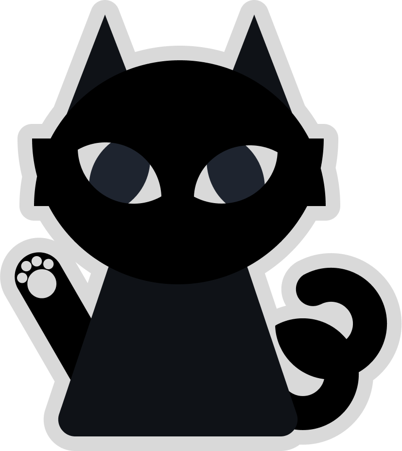

## Team 13
# Black Cat Crew Fortune Teller

[Fortune Telling website](https://cse110-sp23-group13.github.io/cse110-sp23-group13/Fortune-Teller)

# How to Use

## Have you ever wanted to know your future? You've come to the right place!
- Click on the black cat to begin your journey
- Select **Tarot Cards** to recieve a card reading in two different formats:
    - **Yes/No Reading**: Enter a question that can either be answered with yes or no (we will be checking!) and draw a card to recieve your answer!
    - **Career Reading**: Describe a situation and a challenge you have struggled with in your career or career planning, and draw two cards to recieve advice about how your future will play out!
- Select **Zodiac Reading** and enter your birthdate to discover your Zodiac sign and recieve a reading about your personality!

# Future Goals
- More settings options to increase accessibility
- Other tarot card reading methods
- Create backend to recieve feedback
- Add more animations to user actions

[Team Page](/admin/team.md)

[Documentation](https://cse110-sp23-group13.github.io/cse110-sp23-group13/out/)
