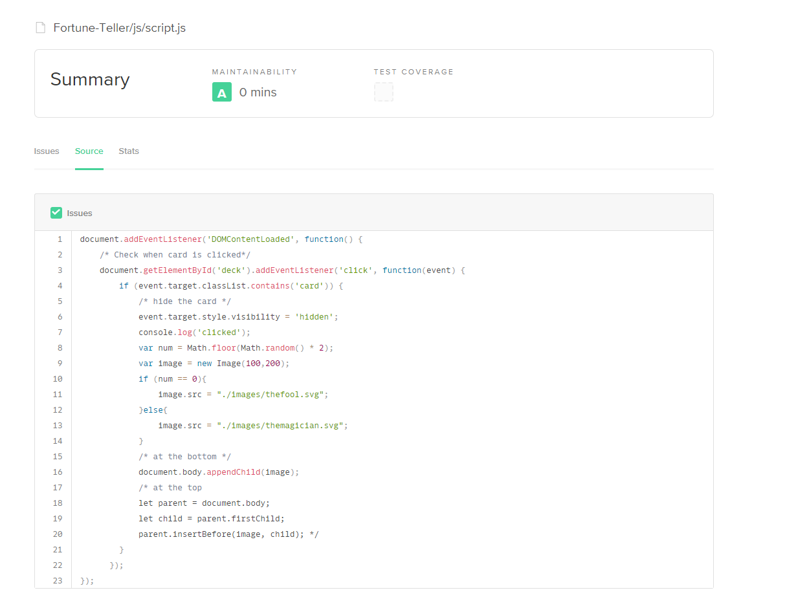
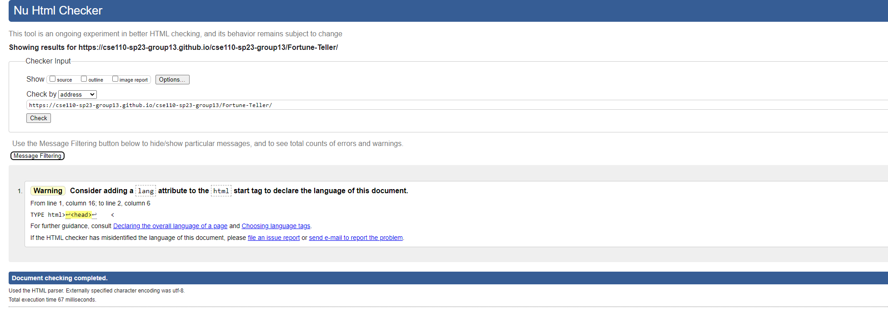
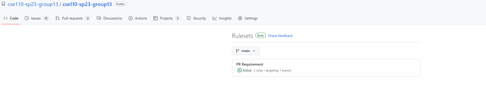

# Phase 1

## Coding style
- Every developers are strictly following the coding style in **Coding Style Guidelines.md** 

## Code Quality
- Tool: We used several tools to check the quality of our code
    - Code Climate

    - W3C HTML validator
    
- Human Reivew: We selected a person to check the functionality and all the coding styles of HTML and css file before merge.

## Unit test
- Planning on using the cypress for testing

## Documentation Generation
- Planning on using the JSDocs
